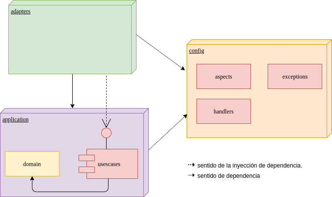

# Titulo
Consulta de Precios


# Descripción
End point rest de consulta tal que, dado fecha de aplicación, identificador de producto, identificador de cadena
retorna información del precio.

# Estado
En contrucción.

# Caracteristicas de la Aplicación
En contrucción.

# Tecnologías Utilizadas

## Backend for frontend - ms-prices-core
Esta basado en el principio de Clean Architecture, con una arquitectura hexagonal.


### Estructura de paquetes

Se definió la siguiente taxonomía de paquetes:

   * **application:** Encapsula toda la lógica de negocio y el modelo del dominio.
        * **domain:** Contiene entidades del dominio. Representa el nucleo de toda la aplicación.
        * **usescases:** Abstracción de los casos de uso del sistema. Contiene además la definición de los puertos y excepciones.
   * **adapters:** Representa la capa de adaptadores (como su nombre indica) que se conectarán en los puertos expuestos por el sistema
   * **config:** Capa transversal a toda la aplicación que contendrá las distintas configuraciones y aspectos del bff.
        



## Java Version
La version que java que se va a utilizar es la 11.0.5 basada en el OpenJDK.

Esta la pueden descargar [aqui](https://github.com/AdoptOpenJDK/openjdk11-upstream-binaries/releases/tag/jdk-11.0.5%2B10).
También se puede instalar usando [SdkMan](https://sdkman.io/), version 11.0.5-open.

## Swagger
### Swagger json
http://localhost:8080/v3/api-docs

### Ambiente local
Se debe levantar el proyecto con el profile "local"

Puede realizarse de 2 maneras: 

* Colocando en la configuracion del booteo del IDE en las "VM Options" la siguiente opcion:
* Ejecutando desde las Tasks de gradle la tarea bootRun y teniendo en los jvmArgs la siguiente opcion: 
```
    **-Dspring.profiles.active=local**
```

### CURL
La siguiente es un curl de ejemplo para utilizar la API, suponiendo que el contexto es localhost:8080:

curl --location --request GET 'http://localhost:8080/api/v1.0/getprice' \
--header 'brandId: 1' \
--header 'productId: 35455' \
--header 'appDate: 2020-06-14-15.00.00'

### Cobertura
Se puede hacer analisis de la cobertura con jacocoTest. Para ello, ejecutar los tests y luego desde el menu de grandle ir a carpeta verification y ejecutar jacocoTestReport.
luego, reporte puede ser encontrado en build/reports/jacoco/test/html/index.hetm
# Autor
[<br><sub>Juan Salas</sub>](https://github.com/jsalas87)